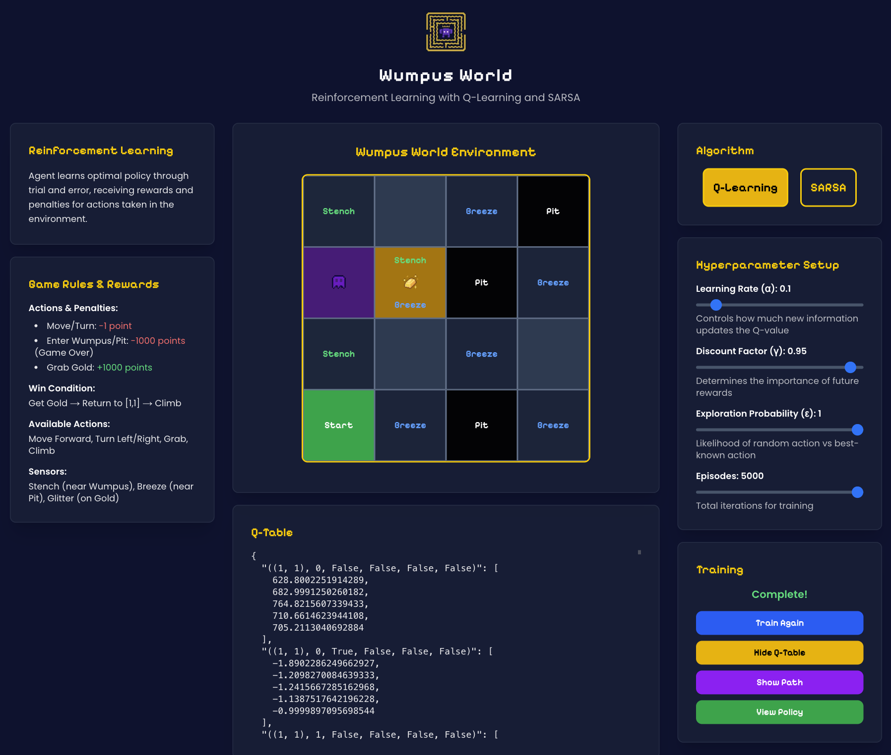

# Wumpus World Reinforcement Learning Simulation

<p align="center">
  
  <br/><br/>
  A web-based implementation of the classic Wumpus World problem using Reinforcement Learning algorithms, featuring Q-Learning and SARSA agents with interactive visualization.
</p>

## Description

This project implements a complete Wumpus World environment where AI agents learn to navigate, collect gold, and return safely using reinforcement learning. The simulation demonstrates the behavioral differences between Q-Learning (off-policy) and SARSA (on-policy) algorithms through an intuitive web interface.

### Key Features

- **Interactive Web Interface**: Modern React-based frontend with real-time visualization
- **Multiple RL Algorithms**: Compare Q-Learning vs SARSA performance and behavior
- **Customizable Hyperparameters**: Adjust learning rate, discount factor, epsilon, and episodes
- **Path Visualization**: See the optimal path discovered by trained agents
- **Q-Table Analysis**: Inspect the learned Q-values for detailed algorithm understanding
- **Standard Wumpus World**: 4x4 grid with Wumpus, gold, pits, and sensors (stench, breeze, glitter)

### Game Rules

- **Grid Size**: 4x4 environment
- **Starting Position**: [1,1] (bottom-left corner)
- **Objective**: Collect gold at [2,3] and return to [1,1] to climb out
- **Hazards**: Wumpus at [1,3], Pits at [3,1], [3,3], [4,4]
- **Rewards**: +1000 for gold collection, -1000 for death, -1 per action
- **Victory Condition**: Grab gold and climb out at starting position

## Installation & Setup

### Prerequisites

- Python 3.8+
- Node.js 16+
- npm or yarn

### Backend Setup

1. Clone the repository
```bash
git clone https://github.com/adndax/wumpus-world/
cd wumpus-world
```

2. Create virtual environment
```bash
python -m venv venv
source venv/bin/activate  # On Windows: venv\Scripts\activate
```

3. Install Python dependencies
```bash
cd backend
pip install -r requirements.txt
```

4. Run the backend server
```bash
python main.py
```
The API server will start on `http://localhost:5001`

### Frontend Setup

1. Navigate to frontend directory
```bash
cd frontend
```

2. Install dependencies
```bash
npm install
```

3. Start the development server
```bash
npm run dev
```
The web application will be available at `http://localhost:3000`

## Usage

1. **Select Algorithm**: Choose between Q-Learning or SARSA
2. **Configure Parameters**: Adjust hyperparameters as needed:
   - Learning Rate (α): Controls learning speed
   - Discount Factor (γ): Importance of future rewards
   - Exploration Probability (ε): Random action likelihood
   - Episodes: Number of training iterations
3. **Start Training**: Click "Start Training" to begin the learning process
4. **View Results**: 
   - Inspect the Q-Table to understand learned values
   - Visualize the optimal path on the grid
   - Compare different algorithm behaviors

## Algorithm Comparison

**Q-Learning (Off-Policy)**:
- Learns optimal policy regardless of exploration strategy
- Often finds shorter, more direct paths
- Aggressive in discovering optimal solutions

**SARSA (On-Policy)**:
- Learns based on actual policy behavior during training
- More conservative, safety-oriented paths
- Reflects realistic agent behavior under uncertainty

## Technical Implementation

- **Backend**: Python Flask API with custom RL algorithm implementations
- **Frontend**: Next.js React application with TypeScript
- **State Representation**: Tuple-based encoding including position, direction, gold status, and sensor readings
- **Learning**: Epsilon-greedy exploration with configurable decay
- **Visualization**: Interactive grid showing agent path and environment hazards
